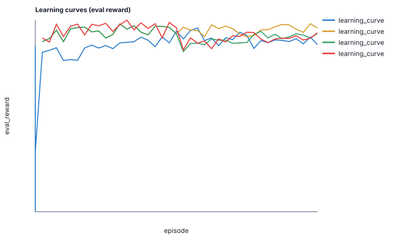

# Blackjack Reinforcement Learning Study

Finite-shoe Blackjack as a controlled RL benchmark: does richer shoe composition and deeper DQN beat a basic-strategy baseline under a **fair training protocol**?

**Read the study:** [docs/paper.md](docs/paper.md)

## Result

Under a **shared 200k-episode Double DQN protocol**, hand-only training (−0.0325) beats full shoe-from-scratch (−0.0877); curriculum + warm-start (−0.0513) lands in between. The rule baseline remains ahead (−0.0103). Details: [docs/paper.md](docs/paper.md) §5.2.

| Condition | Avg reward |
|---|---:|
| Rule-based baseline | **−0.0103** |
| Hand-only (equalized) | −0.0325 |
| Curriculum + warm-start | −0.0513 |
| Curriculum | −0.0654 |
| Full shoe from scratch | −0.0877 |



## Quick start

```bash
python3 -m venv .venv
source .venv/bin/activate
python3 -m pip install -e '.[dev]'
python3 -m pytest
python3 main.py --episodes 1000 --seed 42
```

Train / ablate / plot (details in the study):

```bash
python3 -m agents.double_q_network_learning.train_double_q_network_learning_agent --seed 42
python3 scripts/run_ablation_double_dqn.py --smoke
python3 evaluate_agents.py --episodes 25000 --seed 42
```

## Layout

```text
docs/paper.md           # Study writeup (start here)
docs/results/           # Published legacy benchmarks
agents/                 # Rule, tabular, and neural agents + study protocol
scripts/                # Ablation runner + learning-curve plots
config.py               # Rules and shared experimental protocol
evaluate_agents.py      # Seeded evaluation
```

## License

[MIT](LICENSE)
