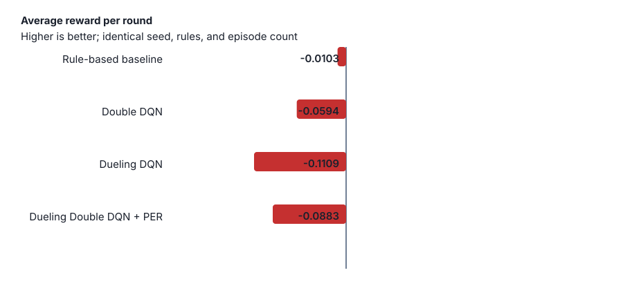

# Does richer shoe state help DQN beat basic strategy?

**A finite-shoe Blackjack study of DQN variants, curricula, and imitation warm-start**

## Abstract

We study flat-bet Blackjack play under a fixed two-deck S17 ruleset with exact remaining-card composition in the observation. Five learning methods (tabular Q-learning through Dueling Double DQN with prioritized replay) are compared to a **2-deck S17 DAS** rule baseline. Under an earlier unequal training budget, no neural checkpoint beat that baseline. With a shared 200k-episode Double DQN protocol, a **hand-only** ablation (−0.0325) outperforms full shoe-from-scratch (−0.0877); curriculum alone (−0.0654) and curriculum + rule warm-start (−0.0513) sit in between. A longer hand-only gap-close run (100k clone + 500k RL) reaches −0.0285 EV under paired eval but still trails the verified rule agent (−0.0034). Across seeds 42–44, hand-only remains best on mean ablation EV (−0.0192 ± 0.0101) and gap-close stays short of the paired rule policy (mean gap −0.0215 ± 0.0039). None yet match the rule agent, but the ranking supports the claim that **state design and initialization dominate architecture depth** for this environment.

## 1. Introduction

Blackjack is a short-horizon MDP with partial observability (dealer hole card hidden) and, in a finite shoe, non-stationary odds as cards leave the deck. Basic strategy is a strong hand-feature heuristic for infinite-deck or composition-agnostic play. The natural machine-learning question is whether richer observations—here, **exact remaining rank counts**—plus deeper Q-learning architectures close the gap with that heuristic under flat unit betting.

This repository is framed as a small empirical study, not a casino edge system. We do not claim positive expected value against the house without bet sizing; the headline metric is expected units per round at unit stake.

**Research question.** Under a fixed casino ruleset and equalized training budget, which interventions help DQN-family agents approach the rule baseline: architecture, state curriculum, imitation warm-start, or shoe-feature ablations?

**Hypothesis.** Architecture alone is insufficient; staged state exposure and/or cloning the rule policy matter more than swapping DQN variants.

## 2. Environment

Configured in [`config/`](../config/), implemented in [`game.py`](../game.py) / [`cards.py`](../cards.py):

| Setting | Value |
|---|---|
| Shoe | 2 decks, persists across rounds |
| Penetration | Reshuffle when ≤ 26 cards remain (default; ≈75% dealt on 2 decks). Configurable via `BlackjackGame(reshuffle_threshold=…)` / `--reshuffle-threshold`; sweep counting edge with `scripts/run_penetration_sweep.py`. |
| Dealer | Stands on all 17s (S17) |
| Blackjack | Pays 3:2 |
| Double / split | DAS; re-split to 4 hands; no hit on split aces |
| Actions | Hit, Stand, Double, Split |
| Betting | Flat unit stake (no insurance / surrender) |

**State.** Agents observe player total, dealer upcard, usable ace, double/split legality, split-hand context, and a 10-D remaining-rank count vector. Neural agents encode this as a shared **19-D** vector (8 hand features + shoe fraction + 10 normalized counts). Curriculum phase A zeros shoe features so the network can learn hand policy first.

**Reward.** Terminal units won/lost for the round (doubles/splits scale via bet multipliers). Greedy evaluation mean reward is the comparison metric; noisy on-policy training reward is not.

## 3. Methods

### 3.1 Agents

| Agent | Role |
|---|---|
| Rule baseline | Verified 2-deck S17 DAS total-dependent chart; ignores shoe counts |
| Tabular Q-learning | Discrete `GameState` keys |
| DQN | MLP + replay + target net |
| Double DQN | Double Q targets |
| Dueling Double DQN | Value/advantage streams |
| Dueling Double DQN + PER | Prioritized replay |

Legal-action masking is used throughout neural agents.

### 3.2 Shared experimental protocol

All neural trainers share defaults in `config/protocol.py` (200k episodes, batch 128, ε 1→0.05 with decay 0.99997, target sync every 2k steps, 2 gradient updates/episode). Mid-run learning-curve probes use 500 greedy episodes every 25k training episodes; published comparisons use the 25k final greedy eval. Trainers accept `--no-curriculum` and `--no-warmstart`.

**Curriculum.** Phase A (100k): shoe features off. Phase B: shoe features on; replay cleared at the boundary.

**Warm-start.** Optional behavior cloning from the rule agent (`agents/warmstart.py`) before RL, using the same encoding mode as the upcoming phase A when curriculum is on.

**Learning curves.** Periodic greedy eval rows in `learning_curve.csv`; plot with `scripts/plot_learning_curves.py`.

### 3.3 Ablations (Double DQN)

| ID | Label | Curriculum | Warm-start | Shoe features |
|---|---|---|---|---|
| A | Full from scratch | off | off | on |
| B | Hand-only | off | off | off entire run |
| C | Curriculum | on | off | phase A→B |
| D | Curriculum + warm-start | on | on | phase A→B |

Runner: `scripts/run_ablation_double_dqn.py` (supports `--smoke`).

## 4. Experiments

- **Legacy architecture table:** 25,000 seeded eval rounds (seed 42) on checkpoints trained under unequal budgets (see training-step column).
- **Ablation:** Double DQN conditions A–D under the shared protocol (200k train / 25k eval, seed 42); results in [`docs/results/ablation_results.json`](results/ablation_results.json).

Primary metric: **expected units per round** under flat betting. Win/loss/draw rates use the sign of net round reward.

## 5. Results

### 5.1 Legacy unequal-budget runs (published)

These numbers are **not** from the equalized protocol. They remain useful as a negative result: deeper nets did not beat basic strategy when compute and schedules differed.

| Agent | Avg reward | Win rate | Loss rate | Draw rate | Training steps |
|---|---:|---:|---:|---:|---:|
| Rule-based baseline | **−0.0103** | **43.11%** | **48.13%** | 8.76% | — |
| Double DQN | −0.0594 | 42.00% | 49.52% | 8.48% | 379,264 |
| Dueling Double DQN + PER | −0.0883 | 41.44% | 50.56% | 8.00% | 91,270 |
| Dueling Double DQN | −0.1109 | 40.67% | 51.33% | 8.00% | 182,484 |



Raw artifacts: [CSV](results/benchmark_results.csv), [JSON](results/benchmark_results.json).

### 5.2 Equalized Double DQN ablations

Double DQN trained for **200,000** episodes per condition under the shared `NEURAL_*` hyperparameters (seed 42). Final greedy evaluation: **25,000** rounds. Rule baseline row is the same seeded eval as §5.1 for reference.

| Condition | Avg reward | Win rate | Loss rate | Draw rate | Training steps |
|---|---:|---:|---:|---:|---:|
| Rule baseline (reference) | **−0.0103** | **43.11%** | **48.13%** | 8.76% | — |
| B. Hand-only | **−0.0325** | 41.98% | 48.71% | 9.31% | 758,860 |
| D. Curriculum + warm-start | −0.0513 | 42.32% | 49.45% | 8.24% | 763,278 |
| C. Curriculum | −0.0654 | 41.76% | 49.92% | 8.32% | 756,260 |
| A. Full from scratch | −0.0877 | 41.20% | 50.16% | 8.64% | 759,120 |


Artifacts: [JSON](results/ablation_results.json), per-condition curves under [`results/ablation/`](results/ablation/).

**Takeaway.** With compute held fixed, exposing shoe counts from episode 1 (A) is the weakest setting. Restricting to hand features (B) closes most of the gap toward the rule agent. Curriculum (C) and curriculum + warm-start (D) beat full scratch but do not beat hand-only under this budget—suggesting composition features remain hard to exploit even when staged.

Reproduce:

```bash
python3 scripts/run_ablation_double_dqn.py --seed 42 --episodes 200000 --eval-episodes 25000
python3 scripts/plot_learning_curves.py docs/results/ablation/*/learning_curve.csv \
  --output docs/results/ablation_learning_curves.svg
```

### 5.3 Hand-only gap-close (paired)

Protocol: true **8-D** hand encoder, **100,000** rule warm-start episodes, **500,000** RL episodes with shoe features off the entire run (`scripts/run_hand_only_gap_close.py`, seed 42). Final greedy evaluation: **25,000** rounds on **paired** per-episode shoes (agent and rule see the same shoe for episode \(i\)).

| Agent | Avg reward | Win | Loss | Draw | Training steps |
|---|---:|---:|---:|---:|---:|
| Rule baseline (verified chart) | **−0.0034** | 43.3% | 48.1% | 8.6% | — |
| Hand-only gap-close | −0.0285 | 42.1% | 48.8% | 9.1% | 1,047,085 |
| Gap (agent − rule) | −0.0250 | — | — | — | — |

Relative to equalized condition B (−0.0325), longer cloning + RL improves hand-only EV slightly (−0.0285), but the verified rule chart under the same paired shoes is much stronger (−0.0034) than the historical published baseline (−0.0103). Flat-bet play remains short of rule-baseline EV.

Artifact note: [`docs/results/gap_close_results.json`](results/gap_close_results.json); learning curve [`docs/results/gap_close/learning_curve.csv`](results/gap_close/learning_curve.csv). Weights are saved locally at `agents/results/double_dqn/gap_close/hand_only_gap_close_model.pt` (gitignored); re-score without retraining via `--eval-only`. Smoke CI writes to `agents/results/double_dqn/gap_close_smoke/`. Standalone rule re-eval: [`docs/results/rule_baseline_paired.json`](results/rule_baseline_paired.json).

Reproduce:

```bash
python3 scripts/run_hand_only_gap_close.py --seed 42
# later, without retraining:
python3 scripts/run_hand_only_gap_close.py --seed 42 --eval-only
```

### 5.4 Multi-seed matrix (seeds 42, 43, 44)

Same protocols as §5.2 / §5.3, repeated over three RNG seeds. Published aggregates report **mean ± sample std** across seeds.

**Ablation (200k train / 25k eval).** Hand-only remains best on mean EV; full-scratch improves vs the historical single-seed A row but with large seed variance. Curriculum variants trail hand-only under this budget.

| Condition | Mean ± std avg reward |
|---|---:|
| B. Hand-only | **−0.0192 ± 0.0101** |
| A. Full from scratch | −0.0230 ± 0.0189 |
| C. Curriculum | −0.0303 ± 0.0076 |
| D. Curriculum + warm-start | −0.0366 ± 0.0107 |

Artifact: [`docs/results/multi_seed_ablation_results.json`](results/multi_seed_ablation_results.json).

**Gap-close (100k clone + 500k RL, paired 25k eval).**

| Metric | Mean ± std |
|---|---:|
| Hand-only agent EV | −0.0191 ± 0.0121 |
| Rule baseline EV (paired) | +0.0024 ± 0.0082 |
| Gap (agent − rule) | −0.0215 ± 0.0039 |

Per-seed agent EV: −0.0285 (42), −0.0233 (43), −0.0054 (44). The gap to the paired rule policy stays negative on every seed.

Artifact: [`docs/results/multi_seed_gap_close_results.json`](results/multi_seed_gap_close_results.json).

Reproduce:

```bash
python3 scripts/run_ablation_double_dqn.py --seeds 42,43,44
python3 scripts/run_hand_only_gap_close.py --seeds 42,43,44
# continue after a pause (skip finished checkpoints):
python3 scripts/run_ablation_double_dqn.py --seeds 42,43,44 --resume
python3 scripts/run_hand_only_gap_close.py --seeds 42,43,44 --resume
```

### 5.5 Variable betting (rule + Hi-Lo spread)

Separate **product** path from the flat-bet RL study: verified rule play with a Hi-Lo true-count stake schedule (1–8 units). Paired eval uses consecutive rounds on seeded shoes so the count can move (fresh per-episode shoes would pin TC≈0). Protocol: **100,000** rounds × seeds 42–44, 100 rounds/shoe.

| Metric | Mean ± std |
|---|---:|
| Flat rule EV/round | −0.0006 ± 0.0068 |
| Spread rule EV/round | **+0.0266 ± 0.0107** |
| Δ EV/round (spread − flat) | **+0.0272 ± 0.0042** |
| Spread EV / unit wagered | +0.0113 ± 0.0046 |
| Average stake (units) | 2.35 ± 0.00 |

Per-seed spread EV/round: +0.0366 (42), +0.0279 (43), +0.0153 (44). Spread beats flat on every seed; mean EV/round is positive.

Artifact: [`docs/results/multi_seed_variable_betting_results.json`](results/multi_seed_variable_betting_results.json). Design: [`docs/design_variable_betting.md`](design_variable_betting.md).

```bash
python3 scripts/run_variable_betting_eval.py --episodes 100000 --seeds 42,43,44 \
  --output docs/results/multi_seed_variable_betting_results.json
```

### 5.6 Penetration sweep (rule + Hi-Lo spread)

Same paired rule / Hi-Lo policies as §5.5, varying the reshuffle cut (remaining-card threshold). Lower cut ⇒ deeper dealt penetration ⇒ more rounds at extreme true counts. Protocol: **100,000** rounds, seed **42**, 100 rounds/shoe; cuts 13 / 26 / 39 / 52 (≈87.5% / 75% / 62.5% / 50% dealt on a 2-deck shoe). Cut 26 is the study default and matches the §5.5 seed-42 row.

| Cut (cards left) | Dealt pen. | Flat EV/round | Spread EV/round | Δ EV/round |
|---|---:|---:|---:|---:|
| 13 | 87.5% | +0.0022 | **+0.0370** | **+0.0348** |
| 26 (default) | 75.0% | +0.0050 | +0.0366 | +0.0316 |
| 39 | 62.5% | +0.0043 | +0.0274 | +0.0231 |
| 52 | 50.0% | +0.0053 | +0.0236 | +0.0183 |

Spread EV/round and Δ both rise with deeper penetration; the max stake share (≥8 units) increases from 6.2% at cut 52 to 14.4% at cut 13. Flat EV stays near zero across cuts on this seed.

Artifact: [`docs/results/penetration_sweep_results.json`](results/penetration_sweep_results.json).

```bash
python3 scripts/run_penetration_sweep.py --episodes 100000 --seed 42 \
  --thresholds 13,26,39,52 \
  --output docs/results/penetration_sweep_results.json
```

## 6. Discussion

Legacy architecture comparisons (§5.1) and the equalized Double DQN ablations (§5.2) both support the hypothesis that **architecture depth is not a substitute for state and training design**. Exact shoe composition enlarges the effective state space; training on full counts from scratch (A) underperforms a hand-only policy (B) by a wide margin on the historical single-seed table. The multi-seed matrix (§5.4) keeps hand-only ahead on mean EV while showing that A is much more seed-sensitive than B–D. Curriculum and rule warm-start help relative to historical A, but under a 200k-episode budget they do not beat hand-only. The paired gap-close (§5.3 / §5.4) improves hand-only further yet remains short of the paired rule policy on every seed (mean gap −0.0215). On the product path, deeper dealt penetration (§5.6) monotonically increases rule+Hi-Lo spread EV and Δ vs flat on seed 42.

**Limitations.** Flat betting is the published study protocol (§5.1–§5.4); variable stake (§5.5) and the penetration cut sweep (§5.6) are a separate product path (`docs/design_variable_betting.md`, `docs/results/multi_seed_variable_betting_results.json`, `docs/results/penetration_sweep_results.json`). §5.6 is single-seed (42) at 100k rounds. No insurance/surrender. §5.1 / §5.2 rule EV rows (−0.0103) remain the **historical** published baseline for those tables; the verified 2-deck S17 DAS chart measures −0.0034 under paired 25k eval (seed 42). Historical §5.2 / §5.3 tables stay single-seed (42); multi-seed mean±std for ablation and gap-close are in §5.4. The multi-seed ablation re-run uses the tightened rule chart for warm-start clones; the published single-seed §5.2 D row still reflects the pre-tighten chart.

**Design history.** The environment went through roughly four major redesigns (splits/doubles → multi-hand rewards → count features → persistent multi-deck shoe). That evolution is part of the experimental story: realism expands the state space faster than naive DQN capacity.

## 7. Reproducibility

```bash
python3 -m venv .venv && source .venv/bin/activate
python3 -m pip install -e '.[dev]'
python3 -m pytest
```

Train (shared protocol; omit flags to use curriculum + warm-start defaults):

```bash
python3 -m agents.train_double_dqn --seed 42
```

Evaluate checkpoints:

```bash
python3 evaluate_agents.py --episodes 25000 --seed 42
```

Ablations and curves: see §5.2 and `scripts/`. Hand-only gap-close: §5.3 / `scripts/run_hand_only_gap_close.py`. Multi-seed matrix: §5.4 (`--seeds 42,43,44`, optional `--resume`). Variable betting (rule + Hi-Lo spread): §5.5 / [`docs/design_variable_betting.md`](design_variable_betting.md) / `scripts/run_variable_betting_eval.py --seeds 42,43,44`. Penetration cut sweep: §5.6 / `scripts/run_penetration_sweep.py`.

## License

MIT. See repository root.
